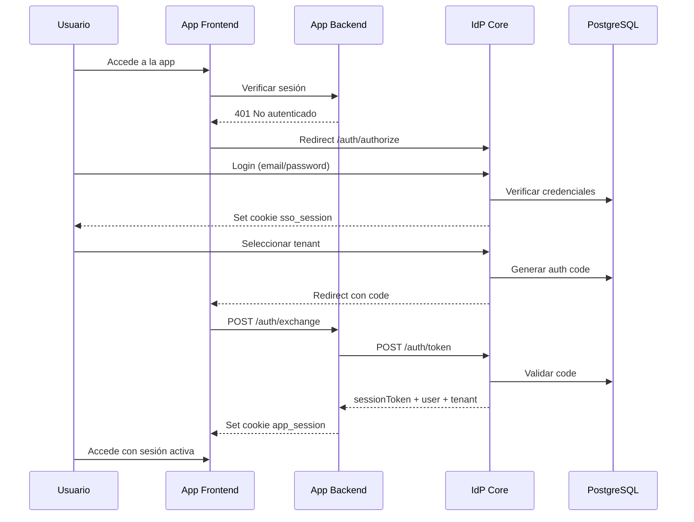

# 🔐 BIGSO IdP Core

Identity Provider (IdP) empresarial open-source con arquitectura hexagonal, multi-tenancy completo y flujo Authorization Code Flow con cookies HttpOnly.

[](https://opensource.org/licenses/MIT)
[](https://nodejs.org/)
[](https://www.typescriptlang.org/)
[](https://www.postgresql.org/)

---

## 📋 Tabla de Contenidos

- [Descripción](#-descripción)
- [Características](#-características)
- [Arquitectura](#-arquitectura)
- [Inicio Rápido](#-inicio-rápido)
- [Desarrollo](#-desarrollo)
- [API Reference](#-api-reference)
- [Documentación](#-documentación)
- [Roadmap](#-roadmap)

---

## 🎯 Descripción

BIGSO IdP Core es un **Identity Provider** centralizado que proporciona:

- **Autenticación unificada** para múltiples aplicaciones (SSO)
- **Multi-tenancy** con aislamiento total de datos (RLS)
- **RBAC granular** con roles y permisos
- **Authorization Code Flow** seguro con PKCE
- **Arquitectura Hexagonal** limpia y mantenible

**Casos de uso ideal para:**
- SaaS B2B con múltiples organizaciones
- Plataformas empresariales con equipos aislados
- Ecosistemas de microservicios con autenticación centralizada
- Sistemas que requieren compliance y seguridad enterprise

---

## ✨ Características

### 🔐 Autenticación Segura

| Feature | Implementación |
|---------|---------------|
| JWT Signing | RS256 (asimétrico) con rotación de claves |
| Password Hashing | Argon2id (resistente a GPUs) |
| Session Management | Cookies HttpOnly + Redis |
| 2FA/TOTP | Google Authenticator, Authy compatible |
| Email Verification | Resend, SMTP, Ethereal adapters |
| Refresh Tokens | Rotación automática con blacklist |

### 🏢 Multi-Tenancy Enterprise

- **Aislamiento físico** mediante Row-Level Security (RLS) en PostgreSQL
- **Roles por tenant:** admin, member, viewer (personalizables)
- **Permisos granulares:** resource:action pattern
- **Member invitations** con gestión de roles
- **App-Tenant association:** control de apps habilitadas por organización

### 🚀 Developer Experience

- **Arquitectura Hexagonal:** separación clara de responsabilidades
- **TypeScript strict:** tipado completo en toda la base de código
- **Prisma ORM:** migrations automáticas y type-safe queries
- **Test suite:** Jest con unit, integration y e2e tests
- **Configuración centralizada:** `config.yaml` + variables de entorno

---

## 🏗️ Arquitectura

### Clean Architecture / Ports & Adapters

```
┌─────────────────────────────────────────────────────────────────┐
│                        INTERFACES                               │
│     (Adaptadores que conectan el mundo exterior)               │
├─────────────────────────────────────────────────────────────────┤
│  HTTP (Express)  │  CLI  │  Events  │  Queue Workers             │
└─────────────────────────┬───────────────────────────────────────┘
                          │
┌─────────────────────────▼───────────────────────────────────────┐
│                     INFRASTRUCTURE                              │
│       (Implementaciones concretas, frameworks)                │
├─────────────────────────────────────────────────────────────────┤
│  Persistence (Prisma/Redis) │ Web (Controllers) │ Security    │
└─────────────────────────┬───────────────────────────────────────┘
                          │
┌─────────────────────────▼───────────────────────────────────────┐
│                     APPLICATION                                 │
│              (Casos de uso, orquestación)                     │
├─────────────────────────────────────────────────────────────────┤
│  Use Cases  │  DTOs  │  Mappers  │  Application Services       │
└─────────────────────────┬───────────────────────────────────────┘
                          │
┌─────────────────────────▼───────────────────────────────────────┐
│                        DOMAIN                                   │
│         (Entidades, reglas de negocio puras)                  │
├─────────────────────────────────────────────────────────────────┤
│  Entities  │  Value Objects  │  Repository Interfaces  │ Events │
└─────────────────────────────────────────────────────────────────┘
```

### Flujo de Dependencias

```
Interfaces ──▶ Infrastructure ──▶ Application ──▶ Domain
     │                │                │            │
     └────────────────┴────────────────┴────────────┘
                    (Domain no depende de nadie)
```

### Stack Tecnológico

| Capa | Tecnología | Versión |
|------|-----------|---------|
| Runtime | Node.js | >= 18 |
| Framework | Express | 4.18+ |
| ORM | Prisma | 5.7+ |
| Database | PostgreSQL | >= 14 |
| Cache | Redis | 6+ |
| Auth | jsonwebtoken | RS256 |
| Passwords | argon2 | latest |
| Testing | Jest | 29+ |

---

## 🚀 Inicio Rápido

### Prerrequisitos

```bash
# Node.js >= 18
node --version  # v18.0.0+

# PostgreSQL >= 14
psql --version  # 14.0+

# Redis (opcional, para cache/sesiones)
redis-server --version  # 6.0+
```

### 1. Instalación

```bash
git clone <repo-url>
cd idp-core
npm install
```

### 2. Configuración de Variables de Entorno

```bash
cp .env.example .env
```

Edita `.env` con tus valores:

```bash
# Base de datos (obligatorio)
DB_TYPE=postgresql
DB_HOST=localhost
DB_PORT=5432
DB_NAME=idp_core
DB_USER=postgres
DB_PASSWORD=your_password

# JWT (obligatorio)
JWT_SECRET=your-super-secret-jwt-key-min-32-chars
JWT_ISSUER=bigso.co
JWT_KID=idp-key-2026

# Email (elige proveedor)
EMAIL_PROVIDER=resend  # smtp | ethereal
RESEND_API_KEY=re_xxxx
RESEND_FROM_EMAIL=noreply@bigso.co

# App defaults
DEFAULT_APP_ID=app-default
DEFAULT_TENANT_ID=tenant-default

# Redis (opcional pero recomendado)
REDIS_HOST=localhost
REDIS_PORT=6379
```

### 3. Generar Claves JWT (RS256)

```bash
mkdir -p keys
openssl genpkey -algorithm RSA -out keys/private.pem -pkeyopt rsa_keygen_bits:2048
openssl rsa -pubout -in keys/private.pem -out keys/public.pem
```

### 4. Setup de Base de Datos

```bash
# Crear base de datos
createdb -U postgres idp_core

# Generar cliente Prisma
npm run prisma:generate

# Ejecutar migraciones
npm run migrate:up

# Seed datos iniciales (opcional)
npm run seed:complete
```

### 5. Iniciar Servidor

```bash
# Desarrollo con hot-reload
npm run dev:watch:hex

# Producción
npm run build
npm start
```

El servidor estará disponible en `http://localhost:3567` (o el puerto configurado en `config.yaml`).

### 6. Verificar Instalación

```bash
# Health check
curl http://localhost:3567/health

# JWKS endpoint
curl http://localhost:3567/.well-known/jwks.json
```

---

## 🧪 Desarrollo

### Scripts Disponibles

```bash
# Desarrollo
npm run dev:watch:hex      # Modo hexagonal con hot-reload
npm run dev:hex           # Modo hexagonal sin watch

# Build y start
npm run build             # Compilar TypeScript
npm start                 # Iniciar en producción

# Testing
npm test                  # Ejecutar tests
npm run test:watch        # Tests en modo watch

# Database
npm run migrate:create    # Crear nueva migración
npm run migrate:up        # Aplicar migraciones
npm run migrate:down      # Revertir última migración
npm run prisma:generate   # Regenerar cliente Prisma

# Linting y formatting
npm run lint            # Verificar código
npm run lint:fix        # Corregir automáticamente
npm run format          # Formatear con Prettier
```

### Ejecutar Tests

```bash
# Unit tests
npm test -- --testPathPattern="domain"

# Integration tests
npm test -- --testPathPattern="integration"

# Tests específicos
npm test -- LoginUseCase.test.ts
```

---

## 📡 API Reference

### Endpoints Principales

| Endpoint | Método | Descripción | Auth |
|----------|--------|-------------|------|
| `/health` | GET | Health check | No |
| `/.well-known/jwks.json` | GET | Claves públicas JWT | No |
| `/api/v1/auth/signup` | POST | Registro de usuario | No |
| `/api/v1/auth/signin` | POST | Inicio de sesión | No |
| `/api/v1/auth/logout` | POST | Cierre de sesión | Cookie |
| `/api/v1/auth/refresh` | POST | Refrescar tokens | Cookie |
| `/api/v1/auth/authorize` | POST | Generar auth code | Cookie |
| `/api/v1/auth/token` | POST | Intercambiar code por tokens | No |
| `/api/v1/user/me` | GET | Perfil del usuario | Bearer |
| `/api/v1/tenants` | GET | Listar mis tenants | Bearer |
| `/api/v1/tenants` | POST | Crear tenant | Bearer |
| `/api/v1/tenants/:id/members` | GET | Miembros del tenant | Bearer |
| `/api/v1/tenants/:id/apps` | GET | Apps del tenant | Bearer |
| `/api/v1/applications` | GET | Listar aplicaciones | Bearer |
| `/api/v1/applications/:id` | GET | Detalle de app | Bearer |
| `/api/v1/admin/stats` | GET | Estadísticas sistema | SystemAdmin |

### Flujo de Autenticación



Ver [docs/shared/api-reference.md](docs/shared/api-reference.md) para documentación completa de la API.

---

## 📚 Documentación

La documentación completa está en [`docs/shared/`](docs/shared/):

| Documento | Descripción |
|-----------|-------------|
| [getting-started.md](docs/shared/getting-started.md) | Guía de instalación detallada |
| [architecture.md](docs/shared/architecture.md) | Decisiones de arquitectura y diagramas |
| [api-reference.md](docs/shared/api-reference.md) | Referencia completa de endpoints |
| [database-schema.md](docs/shared/database-schema.md) | Esquema de base de datos |
| [multi-tenancy.md](docs/shared/multi-tenancy.md) | Guía de multi-tenancy |
| [application-integration.md](docs/shared/application-integration.md) | Integrar apps externas |
| [configuration.md](docs/shared/configuration.md) | Variables de entorno y config.yaml |
| [security.md](docs/shared/security.md) | Cookies, rate limiting, 2FA, RLS |
| [deployment.md](docs/shared/deployment.md) | Docker, Nginx, producción |

### Documentación Técnica Interna

| Archivo | Descripción |
|---------|-------------|
| [src-hex/README.md](src-hex/README.md) | Guía de arquitectura hexagonal |
| [src-hex/domain/README.md](src-hex/domain/README.md) | Domain layer: entidades y reglas |
| [src-hex/application/README.md](src-hex/application/README.md) | Application layer: casos de uso |
| [MIGRATION_GUIDE.md](MIGRATION_GUIDE.md) | Migración de legacy a hexagonal |
| [CLAUDE.md](CLAUDE.md) | Contexto para agentes de IA |

---

## 🗺️ Roadmap

### ✅ Completado

- [x] Arquitectura Hexagonal (Clean Architecture)
- [x] JWT RS256 con rotación de claves
- [x] Password hashing con Argon2
- [x] Sessions con Redis
- [x] Multi-tenancy con RLS
- [x] RBAC con roles y permisos
- [x] 2FA/TOTP con QR codes
- [x] Email verification (3 adapters)
- [x] Application management
- [x] Authorization Code Flow

### 🚧 En Progreso

- [ ] Password reset flow
- [ ] Magic link authentication
- [ ] Audit logging completo

### 📋 Pendiente

- [ ] OAuth 2.0 / OpenID Connect
- [ ] SAML 2.0 support
- [ ] Social login (Google, GitHub, Microsoft)
- [ ] SCIM provisioning
- [ ] Webhook events
- [ ] Admin dashboard

---

## 🤝 Contribuciones

1. Fork el repositorio
2. Crea una rama: `git checkout -b feature/nueva-feature`
3. Commit: `git commit -m 'feat: agrega nueva feature'`
4. Push: `git push origin feature/nueva-feature`
5. Abre un Pull Request

**Estándares:**

- Commits siguen [Conventional Commits](https://www.conventionalcommits.org/)
- TypeScript strict mode obligatorio
- Tests para nuevas features
- Lint y format antes de push

---

## 📄 Licencia

MIT License - Ver [LICENSE](./LICENSE)

---

## 👤 Autor

**Big Labs SAS** - Contacto: cmontes@biglabs.com

---

**¿Preguntas?** Abre un issue o revisa la documentación en `docs/shared/`.
