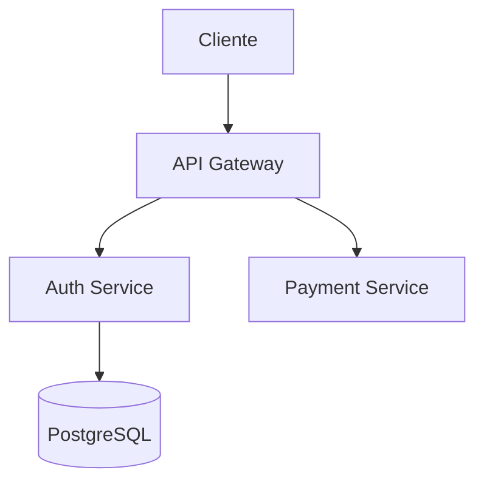

# Contrato de Federación de Documentación — v2.0

## 1. Propósito

Este documento define las reglas para integrar repositorios externos
("Sources") dentro de la Plataforma Central de Documentación.

Objetivos:

- Garantizar documentación consistente y de calidad
- Facilitar el onboarding de nuevos desenvolvedores
- Asegurar ownership visible en cada página
- Permitir sincronización automática
- Evitar documentación tipo wiki sin estructura

Este contrato aplica a todos los repositorios federados.
Cambios breaking incrementan la versión major.

---

## 2. Modelo de Documentación

La plataforma se organiza en tres niveles:

| Nivel | Descripción |
|---|---|
| **Portal** | Sitio central que agrega documentación desde todos los Sources |
| **Equipo** | Agrupación de proyectos por `ownerTeam` del `meta.json` |
| **Proyecto** | Documentación estándar de un sistema, servicio o librería |

Estructura del portal:

```
/<ownerTeam>/<project>/
├── index           ← Overview auto-generado con metadata
├── onboarding      ← Obligatorio
├── architecture    ← Obligatorio
├── integration     ← Obligatorio
├── operations      ← Obligatorio
└── references      ← Obligatorio
```

El `ownerTeam` y `project` se leen del `meta.json` de cada Source.
El portal genera automáticamente la página `index` — no la incluyas en el Source.

---

## 3. Estructura Obligatoria del Source

Todo repositorio federado debe contener en su carpeta designada:

```
sync/feddocs/
├── onboarding.md
├── architecture.md
├── integration.md
├── operations.md
├── references.md
└── meta.json
```

> [!CAUTION]
> Ningún Source será integrado si falta alguno de estos archivos.
> El script de sincronización bloqueará la integración y reportará el error.

---

## 4. Descripción de Archivos

### 4.1 `onboarding.md`

Guía para que un nuevo desarrollador pueda ser productivo con el proyecto.

**Debe incluir:**

- Propósito del sistema (qué problema resuelve)
- Prerequisitos y dependencias
- Instrucciones de setup (clonar, instalar, configurar)
- Ejecución local (cómo levantar el sistema)
- Problemas comunes y cómo resolverlos
- Links a canales de soporte

**Criterio mínimo:** ≥ 200 palabras, ≥ 2 secciones `##`

---

### 4.2 `architecture.md`

Visión técnica del sistema: componentes, flujos y decisiones.

**Debe incluir:**

- Diagrama general del sistema (mermaid recomendado)
- Componentes principales y sus responsabilidades
- Flujos críticos (ej: autenticación, procesamiento de pagos)
- Decisiones técnicas relevantes (ADRs o inline)
- Dependencias externas (bases de datos, servicios, colas)

**Criterio mínimo:** ≥ 200 palabras, ≥ 2 secciones `##`, al menos 1 diagrama

---

### 4.3 `integration.md`

Todo lo que un consumidor necesita para integrarse con el proyecto.

**Debe incluir:**

- APIs expuestas (endpoints, métodos, payloads)
- Ejemplos de consumo con code blocks
- Contratos (request/response)
- Autenticación requerida
- Rate limits, errores comunes
- SDKs o librerías cliente (si existen)

**Criterio mínimo:** ≥ 200 palabras, ≥ 2 secciones `##`, al menos 1 code block

---

### 4.4 `operations.md`

Cómo operar el sistema en producción.

**Debe incluir:**

- Proceso de deploy (CI/CD, manual steps)
- Variables de entorno y configuración
- Monitoreo (métricas, dashboards)
- Alertas y su significado
- Procedimiento de rollback
- Incidentes comunes y runbooks

**Criterio mínimo:** ≥ 200 palabras, ≥ 2 secciones `##`

---

### 4.5 `references.md`

Links y recursos externos relacionados al proyecto.

**Debe incluir:**

- Links a APIs (Swagger/OpenAPI)
- Colecciones Postman o similares
- SDKs o librerías cliente
- Repositorios relacionados
- Documentación externa relevante
- Herramientas internas del equipo

**Criterio mínimo:** ≥ 5 links

---

### 4.6 `meta.json`

Archivo de metadata obligatorio. El portal usa esta información para:
- Agrupar el proyecto bajo su equipo
- Generar badges automáticos de ownership en cada vista
- Mostrar la descripción en el index del proyecto

**Formato:**

```json
{
  "name": "payments-core-api",
  "description": "API principal de pagos con soporte multi-proveedor",
  "project": "core-api",
  "ownerTeam": "payments-team",
  "techLead": "lead@company.com",
  "supportChannel": "#payments",
  "lifecycle": "active",
  "version": "1.0.0",
  "lastReviewed": "2026-02-01"
}
```

| Campo | Obligatorio | Descripción |
|---|---|---|
| `name` | ✅ | Nombre legible del proyecto |
| `description` | ✅ | Resumen corto (1 línea) |
| `project` | ✅ | Slug del proyecto (usado en URLs) |
| `ownerTeam` | ✅ | Equipo dueño (agrupa en el portal) |
| `techLead` | ✅ | Email del tech lead responsable |
| `supportChannel` | ✅ | Canal de Slack/Teams para soporte |
| `lifecycle` | ✅ | Estado actual (ver §5) |
| `version` | ✅ | Versión del sistema |
| `lastReviewed` | ✅ | Fecha ISO de última revisión de docs |

---

## 5. Ciclo de Vida (`lifecycle`)

| Valor | Significado |
|---|---|
| `pilot` | En desarrollo inicial, no usar en producción |
| `active` | Mantenido activamente, en producción |
| `maintenance` | Solo recibe fixes críticos, no features nuevos |
| `deprecated` | Programado para retiro, migrar a alternativa |
| `retired` | Ya no existe, solo referencia histórica |

> [!WARNING]
> Proyectos `deprecated` deberían incluir instrucciones de migración en `onboarding.md`.

---

## 6. Validación

El script de sincronización valida automáticamente:

1. **Existencia:** Todos los archivos de §3 deben estar presentes
2. **Bloqueo:** Si falta cualquier archivo, el Source no se integra
3. **Reporte:** Los errores se reportan en consola con el detalle del faltante

---

## 7. Badges Automáticos

El portal inyecta un badge al inicio de cada vista sincronizada con:

- **Owner:** `ownerTeam` de `meta.json`
- **Lifecycle:** `lifecycle` de `meta.json`
- **Last Reviewed:** `lastReviewed` de `meta.json`
- **Support:** `supportChannel` de `meta.json`

> [!IMPORTANT]
> NO incluyas metadata manualmente en tus archivos `.md`.
> El portal la inyecta automáticamente.

---

## 8. Guía de Contenido

Los archivos Markdown soportan las siguientes features de VitePress.
Usa estas herramientas para crear documentación clara y visual.

### Containers (Callouts)

```md
::: info Título
Información general o contexto.
:::

::: tip Buena Práctica
Recomendación para el equipo.
:::

::: warning Advertencia
Algo a tener en cuenta antes de proceder.
:::

::: danger Peligro
Acción destructiva o irreversible.
:::

::: details Click para expandir
Contenido colapsable, útil para logs o configuración extensa.
:::
```

### Bloques de Código

Syntax highlighting con lenguaje:

````md
```typescript
const token = await authService.getToken()
```
````

Line highlighting (resaltar líneas específicas):

````md
```ts {2,4-6}
function setup() {
  const db = connect()     // ← resaltada
  const cache = initCache()
  const auth = initAuth()  // ← resaltada
  const logger = initLog() // ← resaltada
  const queue = initQueue()// ← resaltada
}
```
````

Diffs en código:

````md
```ts
const url = '/api/v1/auth/logout'  // [!code --]
const url = '/api/v1/auth/signout' // [!code ++]
```
````

Code Groups (tabs para alternativas):

````md
::: code-group
```sh [npm]
npm install @empiresoft/sdk
```
```sh [yarn]
yarn add @empiresoft/sdk
```
```sh [pnpm]
pnpm add @empiresoft/sdk
```
:::
````

### Diagramas Mermaid

```md

```

### Tablas

```md
| Endpoint | Método | Descripción |
|---|---|---|
| /api/v1/auth/token | POST | Obtener token |
| /api/v1/auth/refresh | POST | Renovar token |
```

### Otros

- **Links internos:** `[ver architecture](./architecture.md)`
- **Imágenes:** incluir en la misma carpeta y referenciar con path relativo
- **Emojis:** `:rocket:` → 🚀
- **Table of Contents:** se genera automáticamente desde los headers

> [!CAUTION]
> NO uses HTML directo en los archivos Markdown.
> NO incluyas scripts, iframes, ni contenido externo embebido.