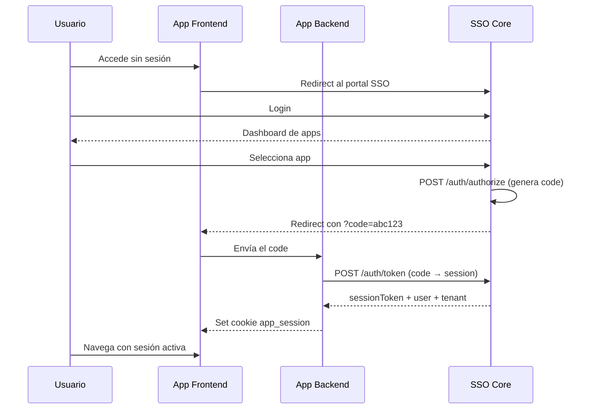

# Integración de Aplicaciones

Guía completa para integrar una aplicación externa con el SSO Core usando el flujo de Authorization Code.

## Visión General



## Paso 1: Registrar la Aplicación

Un System Admin registra la aplicación en el SSO Core:

```bash
curl -X POST http://localhost:3000/api/v1/applications \
  -H "Content-Type: application/json" \
  -b cookies.txt \
  -d '{
    "appId": "crm",
    "name": "CRM System",
    "url": "https://crm.empire.com",
    "description": "Sistema de gestión de clientes"
  }'
```

> [!NOTE]
> El `appId` debe ser lowercase con letras, números y guiones. Es el identificador permanente de la app.

## Paso 2: Habilitar para Tenant

```bash
curl -X POST http://localhost:3000/api/v1/applications/tenant/{tenantId}/enable \
  -H "Content-Type: application/json" \
  -b cookies.txt \
  -d '{
    "applicationId": "uuid-de-la-aplicacion"
  }'
```

## Paso 3: Otorgar Acceso a Usuarios

```bash
# Individual
curl -X POST http://localhost:3000/api/v1/applications/tenant/{tenantId}/{appId}/grant \
  -H "Content-Type: application/json" \
  -b cookies.txt \
  -d '{ "userId": "uuid-del-usuario" }'

# Masivo
curl -X POST http://localhost:3000/api/v1/applications/tenant/{tenantId}/{appId}/grant-bulk \
  -H "Content-Type: application/json" \
  -b cookies.txt \
  -d '{ "userIds": ["uuid1", "uuid2", "uuid3"] }'
```

## Paso 4: Implementar el Backend de la App

### Callback Handler

Cuando el SSO redirige al usuario con un `code`, tu backend debe intercambiarlo por un session token:

```typescript
// routes/auth.ts (en tu aplicación)
import axios from 'axios';

const SSO_URL = process.env.SSO_URL; // ej: https://sso.empire.com

router.post('/callback', async (req, res) => {
  const { code } = req.body;

  // Intercambiar code por session token
  const response = await axios.post(`${SSO_URL}/api/v1/auth/token`, {
    authCode: code,
    appId: 'crm'
  });

  const { sessionToken, expiresAt, user, tenant } = response.data;

  // Guardar session token en cookie HttpOnly
  res.cookie('app_session', sessionToken, {
    httpOnly: true,
    secure: process.env.NODE_ENV === 'production',
    sameSite: 'lax',
    maxAge: 24 * 60 * 60 * 1000 // 24h
  });

  res.json({ success: true, user, tenant });
});
```

### Middleware de Autenticación

Para cada request protegido, verifica el session token con el SSO Core:

```typescript
// middleware/ssoAuth.ts (en tu aplicación)
import axios from 'axios';

export async function ssoAuthMiddleware(req, res, next) {
  const sessionToken = req.cookies['app_session'];

  if (!sessionToken) {
    return res.status(401).json({ error: 'No session' });
  }

  try {
    const response = await axios.post(`${SSO_URL}/api/v1/auth/verify-session`, {
      sessionToken,
      appId: 'crm'
    });

    if (!response.data.valid) {
      return res.status(401).json({ error: 'Invalid session' });
    }

    // Adjuntar contexto al request
    req.ssoUser = response.data.user;
    req.ssoTenant = response.data.tenant;
    next();
  } catch (err) {
    return res.status(401).json({ error: 'Session verification failed' });
  }
}
```

> [!TIP]
> Para mejorar el rendimiento, cachea el resultado de `/verify-session` localmente (ej. Redis con TTL de 60s) para evitar llamar al SSO Core en cada request.

## Paso 5: Registrar Recursos de la App

Define qué recursos y acciones expone tu aplicación para el sistema RBAC:

```bash
curl -X POST http://localhost:3000/api/v1/app-resources \
  -H "Content-Type: application/json" \
  -b cookies.txt \
  -d '{
    "appId": "crm",
    "resources": [
      { "resource": "contacts", "action": "create", "category": "sales" },
      { "resource": "contacts", "action": "read", "category": "sales" },
      { "resource": "contacts", "action": "update", "category": "sales" },
      { "resource": "contacts", "action": "delete", "category": "sales" },
      { "resource": "invoices", "action": "create", "category": "billing" },
      { "resource": "invoices", "action": "read", "category": "billing" },
      { "resource": "reports", "action": "read", "category": "analytics" }
    ]
  }'
```

### Verificar Permisos en la App

Una vez el usuario tiene sesión, puedes consultar sus permisos:

```typescript
// Obtener permisos del usuario para el tenant actual
const permsResponse = await axios.get(
  `${SSO_URL}/api/v1/role/${userRoleId}/permission`,
  { headers: { Cookie: `sso_session=${ssoToken}` } }
);

// Verificar permisos en tu middleware
function requirePermission(resource: string, action: string) {
  return (req, res, next) => {
    const hasPermission = req.permissions?.some(
      p => p.resource === resource && p.action === action
    );
    if (!hasPermission) {
      return res.status(403).json({ error: 'Forbidden' });
    }
    next();
  };
}

// Uso
router.delete('/contacts/:id', requirePermission('contacts', 'delete'), deleteContact);
```

## Paso 6: Frontend — Redirect al SSO

En tu frontend, detecta cuando no hay sesión y redirige al portal SSO:

```typescript
// Angular Guard ejemplo
@Injectable()
export class AuthGuard implements CanActivate {
  constructor(private auth: AuthService, private router: Router) {}

  canActivate(): boolean {
    if (!this.auth.isAuthenticated()) {
      // Redirect al portal SSO con parámetros
      const ssoUrl = environment.ssoPortalUrl;
      const params = new URLSearchParams({
        app_id: 'crm',
        redirect_uri: window.location.origin + '/callback',
        tenant_id: this.auth.getTenantId()
      });
      window.location.href = `${ssoUrl}/authorize?${params}`;
      return false;
    }
    return true;
  }
}
```

## Ejemplo Completo: CRM

### Estructura del Proyecto

```
crm-app/
├── frontend/
│   ├── src/app/
│   │   ├── guards/auth.guard.ts
│   │   ├── services/auth.service.ts
│   │   └── pages/callback/callback.component.ts
├── backend/
│   ├── src/
│   │   ├── routes/auth.ts      # Callback handler
│   │   ├── middleware/sso.ts   # Session verification
│   │   └── routes/contacts.ts  # Protected routes
│   └── .env
```

### Backend `.env`

```bash
SSO_URL=https://sso.empire.com
APP_ID=crm
PORT=4300
```

## Testing

### Flujo Completo con cURL

```bash
# 1. Login en SSO
curl -X POST http://localhost:3000/api/v1/auth/signin \
  -H "Content-Type: application/json" \
  -c cookies.txt \
  -d '{"nuid":"admin@example.com","password":"admin123"}'

# 2. Generar authorization code
curl -X POST http://localhost:3000/api/v1/auth/authorize \
  -H "Content-Type: application/json" \
  -b cookies.txt \
  -d '{
    "tenantId": "uuid-tenant",
    "appId": "crm",
    "redirectUri": "http://localhost:4200/callback"
  }'
# Respuesta: { "authCode": "abc123", "redirectUri": "..." }

# 3. Intercambiar code por session
curl -X POST http://localhost:3000/api/v1/auth/token \
  -H "Content-Type: application/json" \
  -d '{"authCode":"abc123","appId":"crm"}'
# Respuesta: { "sessionToken": "...", "user": {...}, "tenant": {...} }

# 4. Verificar sesión
curl -X POST http://localhost:3000/api/v1/auth/verify-session \
  -H "Content-Type: application/json" \
  -d '{"sessionToken":"jwt-from-step-3","appId":"crm"}'
```

## Troubleshooting

### "APP_ACCESS_DENIED"

El usuario no tiene acceso a la aplicación en ese tenant. Verifica:

1. La app está habilitada para el tenant (`TenantApp`)
2. El usuario tiene acceso otorgado (`UserAppAccess`)

```bash
# Verificar apps del usuario en un tenant
curl http://localhost:3000/api/v1/applications/user/{tenantId} \
  -H "Authorization: Bearer <token>"
```

### "APP_NOT_ENABLED_FOR_TENANT"

La aplicación no está habilitada para el tenant solicitado:

```bash
# Habilitar
curl -X POST http://localhost:3000/api/v1/applications/tenant/{tenantId}/enable \
  -b cookies.txt \
  -H "Content-Type: application/json" \
  -d '{"applicationId":"uuid"}'
```

### "INVALID_AUTH_CODE"

El authorization code ya fue usado o expiró. Los códigos son:
- **De un solo uso**: No se pueden reutilizar
- **TTL de 5 minutos**: Expiran rápidamente
