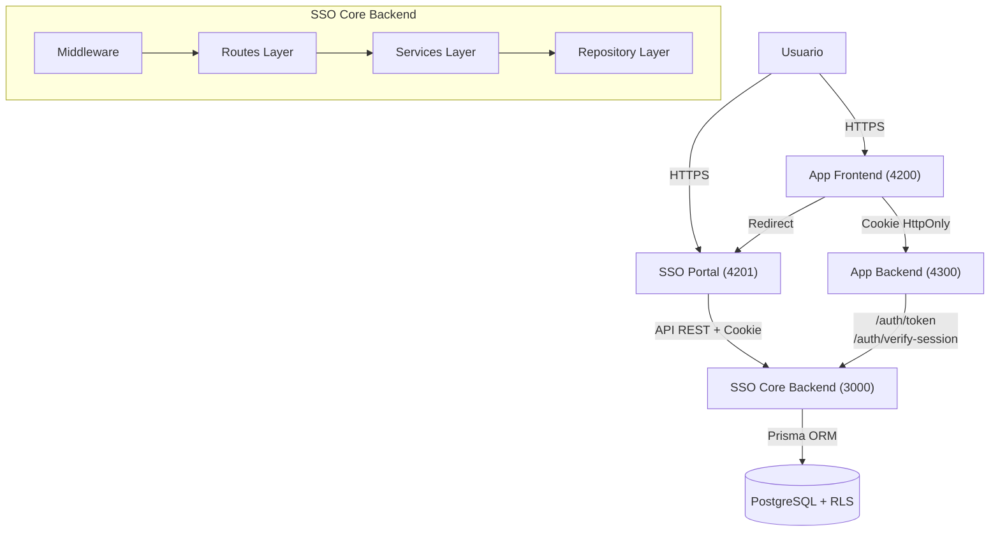
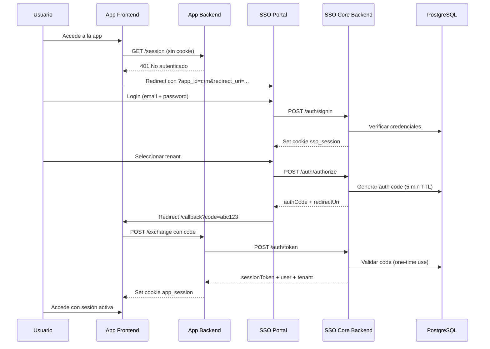

# Arquitectura

El SSO Core es un **Identity Provider (IdP)** centralizado que implementa un flujo de **Authorization Code** inspirado en OAuth 2.0 con cookies HttpOnly.

## Diagrama de Componentes

## Stack Tecnológico

| Capa | Tecnología | Propósito |
| :--- | :--- | :--- |
| Runtime | Node.js 18+ | Ejecución server-side |
| Framework | Express 4.18 | Enrutamiento HTTP |
| ORM | Prisma | Acceso a datos / migrations |
| Base de datos | PostgreSQL 14+ | Persistencia con RLS |
| Hashing | Argon2 | Hashing de contraseñas |
| Tokens | jsonwebtoken (RS256) | Firma asimétrica de JWT |
| Validación | Joi | Schemas de validación |
| Rate Limiting | express-rate-limit | Protección por endpoint |
| Email | Nodemailer / Resend | Verificación y notificaciones |

## Capas de la Aplicación

### Routes (`src/routes/`)

Definen los endpoints HTTP, validan entrada con Joi y delegan al service layer:

| Archivo | Prefijo | Endpoints |
| :--- | :--- | :--- |
| `auth.ts` | `/auth` | signup, signin, logout, authorize, token, verify-session |
| `user.ts` | `/user` | profile, tenants |
| `tenant.ts` | `/tenant` | CRUD, members, apps |
| `role.ts` | `/role` | CRUD, permissions |
| `applications.ts` | `/applications` | CRUD, tenant apps, user access |
| `appResource.ts` | `/app-resources` | register, list, tenant-available |
| `otp.ts` | `/otp` | generate, verify, validate, backup-code |
| `emailVerification.ts` | `/email-verification` | send, verify |
| `session.ts` | `/session` | verify, refresh, revoke |

### Services (`src/services/`)

Lógica de negocio: autenticación, gestión de sesiones, JWT, OTP, email.

### Repositories (`src/repositories/`)

Acceso a datos a través de Prisma Client. Un repositorio por modelo de base de datos.

### Middleware (`src/middleware/`)

| Middleware | Descripción |
| :--- | :--- |
| `auth.ts` | Verifica Bearer token (legacy) |
| `ssoAuth.ts` | Verifica cookie `sso_session` |
| `ssoSystemAdmin.ts` | Verifica roles System Admin / Super Admin |
| `errorHandler.ts` | Manejo centralizado de errores |

## Flujo de Autenticación SSO

El sistema soporta dos modos de autenticación:

### Modo A: App-Initiated

### Modo B: Direct SSO

El usuario accede directamente al portal SSO, ve su dashboard con tenants y aplicaciones, y lanza una app desde ahí. El flujo de generación de código es el mismo.

## Decisiones de Diseño

### ¿Por qué Authorization Code Flow?

- Los tokens **nunca** se exponen en el frontend
- El código de autorización es de **un solo uso** con TTL de 5 minutos
- Los backends validan directamente con el SSO Core

### ¿Por qué Cookies HttpOnly?

- Inmunes a ataques XSS (JavaScript no puede leerlas)
- Se envían automáticamente en cada request
- `SameSite: lax` previene ataques CSRF
- `Secure: true` en producción fuerza HTTPS

### ¿Por qué RS256 y no HS256?

- La clave privada solo la tiene el SSO Core
- Las aplicaciones verifican con la clave pública
- No necesitan conectarse al SSO Core para cada request
- Endpoint JWKS (`/.well-known/jwks.json`) distribuye claves

### ¿Por qué RLS en PostgreSQL?

- El aislamiento entre tenants se garantiza a **nivel de base de datos**
- Incluso si hay un bug en la aplicación, los datos de otro tenant no son accesibles
- Las políticas SQL se aplican transparentemente a todas las queries
