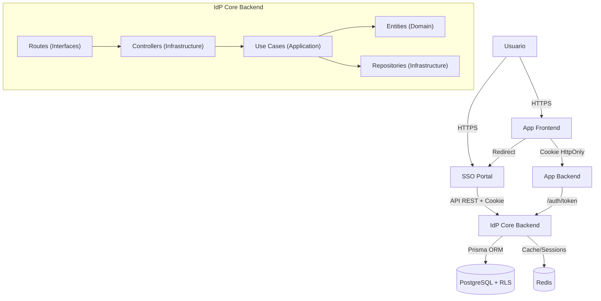
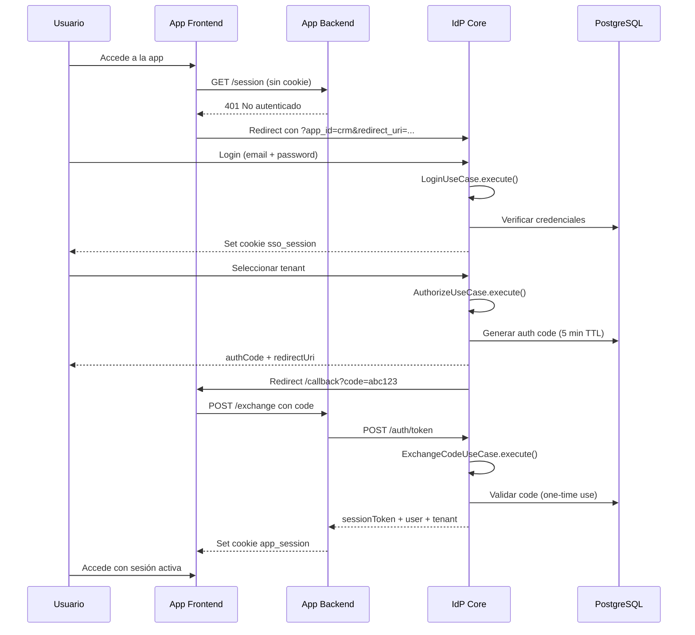

# Arquitectura

BIGSO IdP Core implementa **Clean Architecture** con **Ports & Adapters** (Arquitectura Hexagonal). El sistema está organizado en capas con dependencias que siempre apuntan hacia adentro.

## Diagrama de Capas

```
┌─────────────────────────────────────────────────────────────────┐
│                        INTERFACES                               │
│     (Adaptadores que conectan el mundo exterior)               │
├─────────────────────────────────────────────────────────────────┤
│  HTTP (Express)  │  CLI  │  Events  │  Queue Workers             │
└─────────────────────────┬───────────────────────────────────────┘
                          │
┌─────────────────────────▼───────────────────────────────────────┐
│                     INFRASTRUCTURE                              │
│       (Implementaciones concretas, frameworks)                │
├─────────────────────────────────────────────────────────────────┤
│  Persistence (Prisma/Redis) │ Web (Controllers) │ Security    │
└─────────────────────────┬───────────────────────────────────────┘
                          │
┌─────────────────────────▼───────────────────────────────────────┐
│                     APPLICATION                                 │
│              (Casos de uso, orquestación)                     │
├─────────────────────────────────────────────────────────────────┤
│  Use Cases  │  DTOs  │  Mappers  │  Application Services       │
└─────────────────────────┬───────────────────────────────────────┘
                          │
┌─────────────────────────▼───────────────────────────────────────┐
│                        DOMAIN                                   │
│         (Entidades, reglas de negocio puras)                │
├─────────────────────────────────────────────────────────────────┤
│  Entities  │  Value Objects  │  Repository Interfaces  │ Events │
└─────────────────────────────────────────────────────────────────┘
```

## Flujo de Dependencias

```
Domain ← Application ← Infrastructure ← Interfaces
```

**Reglas absolutas:**
1. **Domain** no tiene imports externos (solo TypeScript puro)
2. **Application** solo importa de Domain
3. **Infrastructure** implementa los ports definidos en Application
4. **Interfaces** conecta el mundo exterior con Infrastructure

## Diagrama de Componentes


```mermaid
graph TD
    User["Usuario"] -->|HTTPS| Portal["SSO Portal"]
    User -->|HTTPS| App["App Frontend"]

    Portal -->|"API REST + Cookie"| Backend["IdP Core Backend"]
    App -->|Redirect| Portal

    subgraph "IdP Core Backend"
        Routes["Routes (Interfaces)"]
        Controllers["Controllers (Infrastructure)"]
        UseCases["Use Cases (Application)"]
        Entities["Entities (Domain)"]
        Repos["Repositories (Infrastructure)"]

        Routes --> Controllers
        Controllers --> UseCases
        UseCases --> Entities
        UseCases --> Repos
    end

    Backend -->|"Prisma ORM"| DB[("PostgreSQL + RLS")]
    Backend -->|"Cache/Sessions"| Redis[("Redis")]

    AppBackend["App Backend"] -->|"/auth/token"| Backend
    App -->|"Cookie HttpOnly"| AppBackend
```

## Capas Detalladas

### Domain Layer (`src-hex/domain/`)

La capa del corazón. Contiene la lógica de negocio pura, sin dependencias externas.

**Componentes:**
- **Entities:** `User`, `Session`, `Tenant`, `Role`, `Application`
- **Value Objects:** `Email`, `PasswordHash`, `SessionToken`
- **Repository Interfaces:** Contratos de persistencia
- **Domain Errors:** Errores específicos del dominio
- **Domain Events:** Eventos para comunicación desacoplada

**Regla:** Ningún import de librerías externas (no Prisma, no Express, no Redis).

### Application Layer (`src-hex/application/`)

Orquestación de casos de uso. Coordina entidades de dominio con puertos externos.

**Componentes:**
- **Use Cases:** Cada operación de negocio es un caso de uso independiente
  - `LoginUseCase`, `RegisterUserUseCase`, `CreateSessionUseCase`
- **DTOs:** Objetos de transferencia de datos (input/output)
- **Ports:** Interfaces que la aplicación expone o necesita
  - **Input Ports:** `IAuthPort`, `ISessionPort`
  - **Output Ports:** `IUserRepository`, `ITokenService`, `IEventBus`
- **Mappers:** Conversión entre entidades de dominio y DTOs

### Infrastructure Layer (`src-hex/infrastructure/`)

Implementaciones concretas de frameworks y herramientas.

**Componentes:**
- **Persistence:** Implementaciones de repositorios
  - `PrismaUserRepository`, `RedisCacheService`
- **Web:** Controllers, middleware, routes (Express)
- **Security:** Implementaciones de seguridad
  - `Argon2PasswordHasher`, `JwtTokenService`
- **External Services:** Email, SMS, etc.

### Interfaces Layer (`src-hex/interfaces/`)

Adaptadores que conectan el mundo exterior con la aplicación.

**Componentes:**
- **HTTP:** `Server.ts`, `Bootstrap.ts`
- **CLI:** Comandos de terminal (futuro)
- **Events:** Consumidores de eventos (futuro)

## Stack Tecnológico

| Capa | Tecnología | Propósito |
|:---|:---|:---|
| Runtime | Node.js 18+ | Ejecución server-side |
| Framework | Express 4.18 | Enrutamiento HTTP |
| ORM | Prisma 5.7+ | Acceso a datos / migrations |
| Database | PostgreSQL 14+ | Persistencia con RLS |
| Cache | Redis 6+ | Sesiones y cache |
| Hashing | Argon2 | Hashing de contraseñas |
| Tokens | jsonwebtoken (RS256) | Firma asimétrica JWT |
| Testing | Jest 29+ | Unit, integration, e2e |

## Flujo de Autenticación SSO

El sistema soporta dos modos de autenticación:

### Modo A: App-Initiated


```mermaid
sequenceDiagram
    participant User as Usuario
    participant App as App Frontend
    participant AppBE as App Backend
    participant SSO as IdP Core
    participant DB as PostgreSQL

    User->>App: Accede a la app
    App->>AppBE: GET /session (sin cookie)
    AppBE-->>App: 401 No autenticado
    App->>SSO: Redirect con ?app_id=crm&redirect_uri=...

    User->>SSO: Login (email + password)
    SSO->>SSO: LoginUseCase.execute()
    SSO->>DB: Verificar credenciales
    SSO-->>User: Set cookie sso_session

    User->>SSO: Seleccionar tenant
    SSO->>SSO: AuthorizeUseCase.execute()
    SSO->>DB: Generar auth code (5 min TTL)
    SSO-->>User: authCode + redirectUri

    SSO->>App: Redirect /callback?code=abc123
    App->>AppBE: POST /exchange con code
    AppBE->>SSO: POST /auth/token
    SSO->>SSO: ExchangeCodeUseCase.execute()
    SSO->>DB: Validar code (one-time use)
    SSO-->>AppBE: sessionToken + user + tenant
    AppBE-->>App: Set cookie app_session

    User->>App: Accede con sesión activa
```

### Modo B: Direct SSO

El usuario accede directamente al portal SSO, ve su dashboard con tenants y aplicaciones, y lanza una app desde ahí.

## Decisiones de Diseño

### ¿Por qué Clean Architecture?

- **Independencia de frameworks:** Podemos cambiar Express por Fastify sin tocar lógica de negocio
- **Testabilidad:** Casos de uso se testean sin mocks de HTTP o BD
- **Separación de responsabilidades:** Cada capa tiene un propósito claro

### ¿Por qué Authorization Code Flow?

- Los tokens **nunca** se exponen en el frontend
- El código de autorización es de **un solo uso** con TTL de 5 minutos
- Los backends validan directamente con el IdP Core

### ¿Por qué Cookies HttpOnly?

- Inmunes a ataques XSS (JavaScript no puede leerlas)
- Se envían automáticamente en cada request
- `SameSite: lax` previene ataques CSRF
- `Secure: true` en producción fuerza HTTPS

### ¿Por qué RS256 y no HS256?

- La clave privada solo la tiene el IdP Core
- Las aplicaciones verifican con la clave pública
- No necesitan conectarse al IdP Core para cada request
- Endpoint JWKS (`/.well-known/jwks.json`) distribuye claves

### ¿Por qué RLS en PostgreSQL?

- El aislamiento entre tenants se garantiza a **nivel de base de datos**
- Incluso si hay un bug en la aplicación, los datos de otro tenant no son accesibles
- Las políticas SQL se aplican transparentemente a todas las queries

## Mapeo de Archivos

### Desde implementación legacy a arquitectura hexagonal:

| Implementación Legacy | Capa Hexagonal | Ubicación Nueva |
|:---|:---|:---|
| `services/authV2.ts` | Application / Use Cases | `application/use-cases/auth/` |
| `services/user.ts` | Application / Services | `application/services/` |
| `repositories/*.prisma.ts` | Infrastructure / Persistence | `infrastructure/persistence/prisma/` |
| `repositories/redis*.ts` | Infrastructure / Persistence | `infrastructure/persistence/redis/` |
| `routes/v2/*.ts` | Infrastructure / Web | `infrastructure/web/routes/` |
| `services/email.ts` | Infrastructure / External | `infrastructure/external-services/email/` |
| `services/jwt.ts` | Infrastructure / Security | `infrastructure/security/` |
| `middleware/*.ts` | Infrastructure / Web | `infrastructure/web/middleware/` |

## Convenciones de Código

### Nomenclatura

| Elemento | Convención | Ejemplo |
|:---|:---|:---|
| Clases | PascalCase | `LoginUseCase` |
| Interfaces | I + PascalCase | `IUserRepository` |
| Variables | camelCase | `userRepository` |
| Constantes | SCREAMING_SNAKE | `MAX_RETRY` |
| Archivos | PascalCase.ts | `LoginUseCase.ts` |

### Estructura de un Caso de Uso

```typescript
export class LoginUseCase {
  constructor(
    private userRepository: IUserRepository,
    private tokenService: ITokenService,
    private hasher: IPasswordHasher
  ) {}

  async execute(input: LoginInput): Promise<Result<LoginResult>> {
    // 1. Obtener entidad
    const user = await this.userRepository.findByEmail(input.email);
    if (!user) {
      return Result.fail(new InvalidCredentialsError());
    }

    // 2. Ejecutar lógica de dominio
    const valid = await this.hasher.verify(input.password, user.passwordHash);
    if (!valid) {
      return Result.fail(new InvalidCredentialsError());
    }

    // 3. Persistir cambios
    const session = await this.tokenService.generate(user);

    // 4. Retornar resultado
    return Result.ok({
      accessToken: session.accessToken,
      refreshToken: session.refreshToken,
    });
  }
}
```

## Testing

### Pirámide de Tests

```
    /\
   /  \     E2E Tests (integration/)
  /____\    
 /      \   Integration Tests (infrastructure/)
/________\  Unit Tests (domain/, application/)
```

- **Unit Tests:** Entidades de dominio, lógica pura
- **Integration Tests:** Repositorios con BD real
- **E2E Tests:** Flujos completos HTTP

## Referencias

- [Clean Architecture by Robert C. Martin](https://blog.cleancoder.com/uncle-bob/2012/08/13/the-clean-architecture.html)
- [Ports and Adapters Pattern](https://alistair.cockburn.us/hexagonal-architecture/)
- [Domain-Driven Design](https://martinfowler.com/tags/domain%20driven%20design.html)
