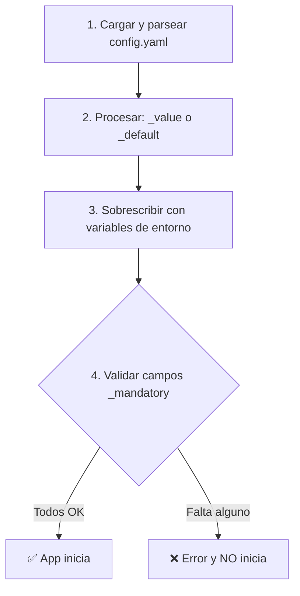

# Configuración

El SSO Core utiliza un **sistema de configuración declarativo** de tres capas que combina `config.yaml`, variables de entorno y validación automática al inicio.

## Prioridad de Configuración

El sistema resuelve valores en este orden (de mayor a menor prioridad):

```
Variables de Entorno (.env) > _value (config.yaml) > _default (config.yaml)
```

Si una variable está definida en `.env`, siempre tiene prioridad sobre `config.yaml`.

## Formato del config.yaml

Cada variable puede tener tres propiedades:

```yaml
nombre_variable:
  _mandatory: true      # ¿Es obligatoria? (true/false)
  _default: valor       # Valor por defecto si no se define
  _value: valor_actual  # Valor actual/configurado
```

### Ejemplos

**Variable con default:**

```yaml
port:
  _default: 3567
  _value: 3567
```

**Variable obligatoria (debe venir de `.env`):**

```yaml
database:
  password:
    _mandatory: true
    _value: null
```

**Variable anidada:**

```yaml
session:
  expiry_time:
    _default: 3600
    _value: 3600
```

Acceso en código: `Config.get('session.expiry_time')` → `3600`

## Variables Obligatorias

Campos marcados con `_mandatory: true` que **deben** tener valor. Si falta alguno, la aplicación **no iniciará**.

| Campo | Variable de Entorno | Descripción |
| :--- | :--- | :--- |
| `database.type` | `DB_TYPE` | Tipo de BD (`postgresql`) |
| `database.host` | `DB_HOST` | Host de la base de datos |
| `database.port` | `DB_PORT` | Puerto de la base de datos |
| `database.name` | `DB_NAME` | Nombre de la base de datos |
| `database.user` | `DB_USER` | Usuario de la base de datos |
| `database.password` | `DB_PASSWORD` | Contraseña de la BD |
| `jwt.secret` | `JWT_SECRET` | Secreto para firmar tokens JWT |

**Error si falta un campo obligatorio:**

```
❌ Configuration validation failed:
   Mandatory field 'jwt.secret' is missing or empty
Configuration validation failed: 1 mandatory field(s) missing
```

## Valores por Defecto

Campos con `_default` que se usan si `_value` está vacío:

| Campo | Default | Descripción |
| :--- | :--- | :--- |
| `port` | `3567` | Puerto del servidor |
| `host` | `localhost` | Host del servidor |
| `jwt.algorithm` | `HS256` | Algoritmo JWT |
| `access_token_validity` | `3600` | Validez del access token (1h) |
| `refresh_token_validity` | `604800` | Validez del refresh token (7d) |
| `session.expiry_time` | `3600` | Expiración de sesión (1h) |
| `logging.level` | `info` | Nivel de logging |
| `cors.enabled` | `true` | CORS habilitado |
| `features.email_verification` | `true` | Verificación de email |
| `features.multitenancy` | `true` | Multi-tenancy habilitado |

## Variables de Entorno

### Servidor

| Variable | Mapea a | Descripción |
| :--- | :--- | :--- |
| `PORT` | `port` | Puerto del servidor |
| `HOST` | `host` | Host del servidor |
| `NODE_ENV` | — | Modo de entorno (`development` / `production`) |

### Base de Datos

| Variable | Mapea a | Descripción |
| :--- | :--- | :--- |
| `DB_TYPE` | `database.type` | Tipo de BD |
| `DB_HOST` | `database.host` | Host |
| `DB_PORT` | `database.port` | Puerto |
| `DB_NAME` | `database.name` | Nombre |
| `DB_USER` | `database.user` | Usuario |
| `DB_PASSWORD` | `database.password` | Contraseña |
| `DATABASE_URL` | `database.url` | Conexión completa (alternativa) |

### JWT y Tokens

| Variable | Mapea a | Descripción |
| :--- | :--- | :--- |
| `JWT_SECRET` | `jwt.secret` | Secreto para firmar tokens ⚠️ **OBLIGATORIO** |
| `JWT_ALGORITHM` | `jwt.algorithm` | Algoritmo de firma |
| `JWT_ISS` | `jwt.iss` | Issuer del JWT |
| `JWT_AUD` | `jwt.aud` | Audience |
| `JWT_KID` | `jwt.kid` | Key ID |
| `PRIVATE_KEY_PATH` | `jwt.private_key_path` | Ruta a clave privada RSA |
| `PUBLIC_KEY_PATH` | `jwt.public_key_path` | Ruta a clave pública RSA |
| `ACCESS_TOKEN_VALIDITY` | `access_token_validity` | Duración del access token (seg) |
| `REFRESH_TOKEN_VALIDITY` | `refresh_token_validity` | Duración del refresh token (seg) |

### Cookies SSO

| Variable | Descripción |
| :--- | :--- |
| `COOKIE_DOMAIN` | Dominio para cookies SSO (ej. `.empire.com`). Solo se aplica en `production`. |

> [!NOTE]
> En desarrollo, NO se establece dominio en las cookies para que funcionen con `localhost`.

### CORS

| Variable | Mapea a | Descripción |
| :--- | :--- | :--- |
| `CORS_ORIGIN` | `cors.origin` | Orígenes permitidos |
| `CORS_CREDENTIALS` | `cors.credentials` | Permitir cookies cross-origin |
| `CORS_METHODS` | `cors.methods` | Métodos HTTP permitidos |

### Rate Limiting

Los limitadores se configuran **por endpoint** directamente en el código:

| Endpoint | Ventana | Máximo | Config Key |
| :--- | :--- | :--- | :--- |
| `/auth/signup` | 1 hora | 5 | `rateLimit.signup.*` |
| `/auth/signin` | 15 minutos | 10 | `rateLimit.signin.*` |
| `/auth/refresh` | 1 minuto | 30 | `rateLimit.refresh.*` |
| `/auth/signout` | 1 minuto | 60 | `rateLimit.signout.*` |

### Logging

| Variable | Mapea a | Descripción |
| :--- | :--- | :--- |
| `LOG_LEVEL` | `logging.level` | Nivel (`info`, `debug`, `warn`, `error`) |

## Ejemplos de Uso

### Desarrollo Local

**`.env`:**

```bash
DB_HOST=localhost
DB_PORT=5432
DB_NAME=sso_dev
DB_USER=dev_user
DB_PASSWORD=dev_pass
JWT_SECRET=dev-secret-key
```

Sin variables de entorno adicionales → usa valores de `config.yaml` + defaults.

### Producción

**`.env`:**

```bash
DB_HOST=production-db.example.com
DB_PASSWORD=super-secure-password
JWT_SECRET=production-jwt-secret-very-long-and-random
PORT=8080
LOG_LEVEL=error
NODE_ENV=production
COOKIE_DOMAIN=.empire.com
```

## API del ConfigManager

```typescript
// Cargar configuración
await Config.load();

// Leer valores
const port = Config.get('port');                      // 3567
const dbHost = Config.get('database.host');            // 'localhost'
const unknown = Config.get('unknown.key', 'default');  // 'default'

// Establecer valores en runtime
Config.set('logging.level', 'debug');

// Obtener toda la configuración
const allConfig = Config.getAll();
```

## Flujo de Carga



## Troubleshooting

### "Mandatory field missing"

Define el campo en `.env` o en `config.yaml`:

```bash
export JWT_SECRET="my-secret-key"
# o
echo "JWT_SECRET=my-secret-key" >> .env
```

### `.env` no se lee

El ConfigManager **no carga** archivos `.env` automáticamente. Asegúrate de usar `dotenv`:

```typescript
import dotenv from 'dotenv';
dotenv.config();

await Config.load();
```

### Default no se aplica

Si el campo tiene un valor vacío `""` en `config.yaml`, el default no se aplica. Usa `null` o elimina el campo:

```yaml
# ❌ No funciona
port: ""

# ✅ Funciona
# port: (comentado o eliminado)
```
