# Database Schema

Documentación completa del esquema de base de datos del SSO Core, generado a partir de `prisma/schema.prisma`.

## Diagrama ER

```mermaid
erDiagram
    User ||--o{ Session : "tiene"
    User ||--o{ TenantMember : "pertenece a"
    User ||--o{ UserAppAccess : "accede a"
    User ||--o{ Address : "tiene"
    User ||--o{ EmailVerification : "verifica"
    User ||--o{ OTPSecret : "configura"
    User ||--o{ AuthorizationCode : "genera"
    User ||--o{ AppSession : "tiene"
    User ||--o{ SSOSession : "tiene"

    Tenant ||--o{ TenantMember : "tiene"
    Tenant ||--o{ TenantApp : "habilita"
    Tenant ||--o{ Role : "define"
    Tenant ||--o{ UserAppAccess : "acceso en"
    Tenant ||--o{ AppSession : "pertenece a"

    Application ||--o{ TenantApp : "habilitada en"
    Application ||--o{ UserAppAccess : "acceso a"
    Application ||--o{ AppResource : "define"

    Role ||--o{ Permission : "tiene"
    AppResource ||--o{ Permission : "referenciada por"

    User {
        uuid id PK
        string email UK
        string passwordHash
        string firstName
        string secondName
        string lastName
        string secondLastName
        string phone
        datetime birthDate
        string gender
        string nationality
        string userStatus
        string systemRole
        boolean emailVerified
        datetime createdAt
        datetime updatedAt
    }

    Tenant {
        uuid id PK
        string name
        string slug UK
        datetime createdAt
        datetime updatedAt
    }

    TenantMember {
        uuid id PK
        uuid userId FK
        uuid tenantId FK
        string role
        datetime joinedAt
        datetime updatedAt
    }

    Application {
        uuid id PK
        string appId UK
        string name
        string url
        string description
        string logoUrl
        boolean isActive
        datetime createdAt
        datetime updatedAt
    }

    TenantApp {
        uuid id PK
        uuid tenantId FK
        uuid applicationId FK
        boolean isEnabled
        json config
        datetime enabledAt
        datetime updatedAt
    }

    UserAppAccess {
        uuid id PK
        uuid userId FK
        uuid tenantId FK
        uuid applicationId FK
        uuid grantedBy
        datetime grantedAt
    }

    Role {
        uuid id PK
        string name
        string description
        uuid tenantId FK
        boolean isDefault
        datetime createdAt
        datetime updatedAt
    }

    Permission {
        uuid id PK
        uuid roleId FK
        uuid applicationId FK
        string resource
        string action
        uuid appResourceId FK
        datetime createdAt
    }

    AppResource {
        uuid id PK
        uuid applicationId FK
        string resource
        string action
        string category
        string description
        datetime createdAt
        datetime updatedAt
    }

    Session {
        uuid id PK
        uuid userId FK
        string refreshToken
        string ip
        string userAgent
        boolean isActive
        datetime expiresAt
        datetime createdAt
        datetime updatedAt
    }

    SSOSession {
        uuid id PK
        uuid userId FK
        string sessionToken UK
        string ip
        string userAgent
        boolean isActive
        datetime expiresAt
        datetime createdAt
    }

    AppSession {
        uuid id PK
        string sessionToken UK
        string appId
        uuid userId FK
        uuid tenantId FK
        string role
        string ip
        string userAgent
        datetime expiresAt
        datetime createdAt
    }

    AuthorizationCode {
        uuid id PK
        string code UK
        uuid userId FK
        string tenantId
        string appId
        string redirectUri
        boolean used
        datetime expiresAt
        datetime createdAt
    }

    EmailVerification {
        uuid id PK
        uuid userId FK
        string email
        string token UK
        boolean used
        datetime expiresAt
        datetime createdAt
    }

    OTPSecret {
        uuid id PK
        uuid userId FK
        string secret
        boolean verified
        string backupCodes
        datetime createdAt
        datetime updatedAt
    }

    Address {
        uuid id PK
        uuid userId FK
        string country
        string province
        string city
        string detail
        string postalCode
    }
```

## Modelos del Schema

### User

Tabla central de usuarios del sistema.

| Campo | Tipo | Descripción |
| :--- | :--- | :--- |
| `id` | UUID | Identificador único |
| `email` | String | Email único del usuario |
| `passwordHash` | String | Hash Argon2 del password |
| `firstName`, `lastName` | String | Nombres del usuario |
| `secondName`, `secondLastName` | String? | Nombres opcionales |
| `phone` | String? | Teléfono |
| `birthDate` | DateTime? | Fecha de nacimiento |
| `gender` | String? | Género |
| `nationality` | String? | Nacionalidad |
| `userStatus` | String | `active`, `inactive`, `suspended` |
| `systemRole` | String | `super_admin`, `system_admin`, `user` |
| `emailVerified` | Boolean | Verificación de email completada |

### Tenant

Organización que agrupa usuarios y aplicaciones.

| Campo | Tipo | Descripción |
| :--- | :--- | :--- |
| `id` | UUID | Identificador único |
| `name` | String | Nombre de la organización |
| `slug` | String | Slug único para URLs |

### TenantMember

Relación entre usuarios y tenants, con su rol.

| Campo | Tipo | Descripción |
| :--- | :--- | :--- |
| `userId` | UUID | FK → User |
| `tenantId` | UUID | FK → Tenant |
| `role` | String | `admin`, `member`, `viewer`, o personalizado |

**Index único:** `(userId, tenantId)` — Un usuario solo puede pertenecer una vez a un tenant.

### Application

Aplicaciones registradas en el sistema SSO.

| Campo | Tipo | Descripción |
| :--- | :--- | :--- |
| `appId` | String | Identificador legible (ej. `crm`) |
| `name` | String | Nombre de la aplicación |
| `url` | String | URL de la aplicación |
| `isActive` | Boolean | Soft delete flag |

### TenantApp

Vincula aplicaciones con tenants.

| Campo | Tipo | Descripción |
| :--- | :--- | :--- |
| `tenantId` | UUID | FK → Tenant |
| `applicationId` | UUID | FK → Application |
| `isEnabled` | Boolean | Si la app está activa para este tenant |
| `config` | JSON? | Configuración específica del tenant |

**Index único:** `(tenantId, applicationId)` — Una app solo se puede habilitar una vez por tenant.

### UserAppAccess

Control de acceso granular: qué usuarios pueden usar qué apps dentro de un tenant.

| Campo | Tipo | Descripción |
| :--- | :--- | :--- |
| `userId` | UUID | FK → User |
| `tenantId` | UUID | FK → Tenant |
| `applicationId` | UUID | FK → Application |
| `grantedBy` | UUID | Quién otorgó el acceso |

**Index único:** `(userId, tenantId, applicationId)`

### Role y Permission

Roles personalizables con permisos granulares por aplicación.

**Permission:**

| Campo | Tipo | Descripción |
| :--- | :--- | :--- |
| `roleId` | UUID | FK → Role |
| `applicationId` | UUID | FK → Application |
| `resource` | String | Recurso (ej. `users`, `invoices`) |
| `action` | String | Acción (ej. `create`, `read`, `update`, `delete`) |

### AppResource

Catálogo de recursos disponibles por aplicación.

| Campo | Tipo | Descripción |
| :--- | :--- | :--- |
| `applicationId` | UUID | FK → Application |
| `resource` | String | Nombre del recurso |
| `action` | String | Acción permitida |
| `category` | String? | Categoría para agrupación |

### Session / SSOSession / AppSession

| Tabla | Propósito |
| :--- | :--- |
| `Session` | Sesiones legacy (refresh token) |
| `SSOSession` | Sesiones del portal SSO (cookie `sso_session`) |
| `AppSession` | Sesiones de aplicaciones individuales (vía `/auth/token`) |

### AuthorizationCode

Códigos de autorización de un solo uso para el flujo SSO.

| Campo | Tipo | Descripción |
| :--- | :--- | :--- |
| `code` | String | Código único |
| `userId` | UUID | Usuario que autorizó |
| `tenantId` | String | Contexto del tenant |
| `appId` | String | Aplicación destino |
| `used` | Boolean | Si ya fue consumido |
| `expiresAt` | DateTime | Expiración (5 minutos) |
