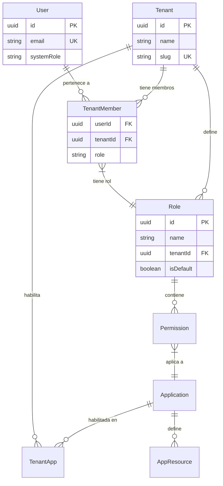
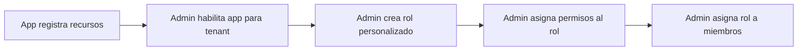

# Multi-Tenancy

El SSO Core implementa una arquitectura **multi-tenant** completa donde cada organización (tenant) tiene datos lógicamente aislados, roles independientes y aplicaciones habilitadas por separado.

## Modelo de Datos



## Jerarquía Tenant → Miembro → Rol → Permisos

Cada tenant tiene su propia jerarquía de control de acceso:

```
Tenant
├── Members (usuarios)
│   └── Role (admin, member, viewer, personalizado)
│       └── Permissions (resource + action + applicationId)
├── Roles personalizados
└── Apps habilitadas (TenantApp)
    └── User App Access (qué miembros usan qué apps)
```

## Row-Level Security (RLS)

Las tablas sensibles tienen una columna `tenant_id`. PostgreSQL fuerza el aislamiento con políticas RLS:

### Cómo funciona

1. El middleware SSO detecta el `tenantId` del request (de la sesión o del body).
2. Se establece una variable de sesión PostgreSQL:

```sql
SET app.current_tenant_id = 'uuid-del-tenant';
```

3. Las políticas RLS filtran automáticamente **todas** las queries:

```sql
CREATE POLICY tenant_isolation ON tenant_members
USING (tenant_id = current_setting('app.current_tenant_id')::uuid);
```

> [!IMPORTANT]
> Esto significa que incluso si hay un bug en el código de la aplicación que olvide filtrar por tenant, la base de datos NO devolverá datos de otro tenant.

## Roles Predeterminados

Cuando se crea un nuevo tenant, el sistema genera automáticamente tres roles con permisos predefinidos:

### Admin

Acceso total. 18 permisos SSO incluyendo CRUD de usuarios, tenants, roles y aplicaciones.

### Member

Acceso estándar. 4 permisos: lectura de perfil, modificación de datos propios.

### Viewer

Solo lectura. 1 permiso: ver datos propios.

> [!NOTE]
> Los permisos de estos roles predeterminados NO se pueden modificar. Para control de acceso personalizado, crea roles nuevos.

## RBAC — Control de Acceso Basado en Roles

### Permisos por Aplicación

Cada permiso está vinculado a una **aplicación específica** y define un par `resource:action`:

```json
{
  "applicationId": "uuid-de-sso",
  "resource": "users",
  "action": "create"
}
```

Las aplicaciones registran sus recursos disponibles mediante el endpoint `/app-resources`. Esto permite que cada app defina su propio catálogo de permisos sin hardcodear nada en el frontend.

### Flujo de Asignación de Permisos



### App Resources

Cada aplicación puede definir sus propios recursos y acciones:

```json
{
  "appId": "crm",
  "resources": [
    { "resource": "invoices", "action": "create", "category": "billing" },
    { "resource": "invoices", "action": "read", "category": "billing" },
    { "resource": "contacts", "action": "update", "category": "sales" }
  ]
}
```

> [!TIP]
> Los recursos se registran típicamente durante el deployment de la aplicación usando `POST /api/v1/app-resources`.

## Gestión de Apps por Tenant

### Habilitar una App

Un System Admin o Tenant Admin puede habilitar una aplicación para un tenant:

```bash
POST /api/v1/applications/tenant/:tenantId/enable
Body: { "applicationId": "uuid" }
```

### Control de Acceso de Usuarios

No todos los miembros de un tenant tienen acceso a todas las apps. El acceso se otorga individualmente o en bulk:

| Endpoint | Propósito |
| :--- | :--- |
| `POST .../grant` | Dar acceso a un usuario |
| `POST .../grant-bulk` | Dar acceso a múltiples usuarios |
| `DELETE .../revoke/:userId` | Revocar acceso |
| `GET .../users` | Listar usuarios con acceso |

### Validación de Acceso

Cuando un usuario intenta acceder a una app, el SSO Core verifica:

1. ¿El usuario es miembro del tenant? → `TenantMember`
2. ¿La app está habilitada para el tenant? → `TenantApp`
3. ¿El usuario tiene acceso a la app? → `UserAppAccess`

Solo si las tres validaciones pasan, se genera el authorization code.
