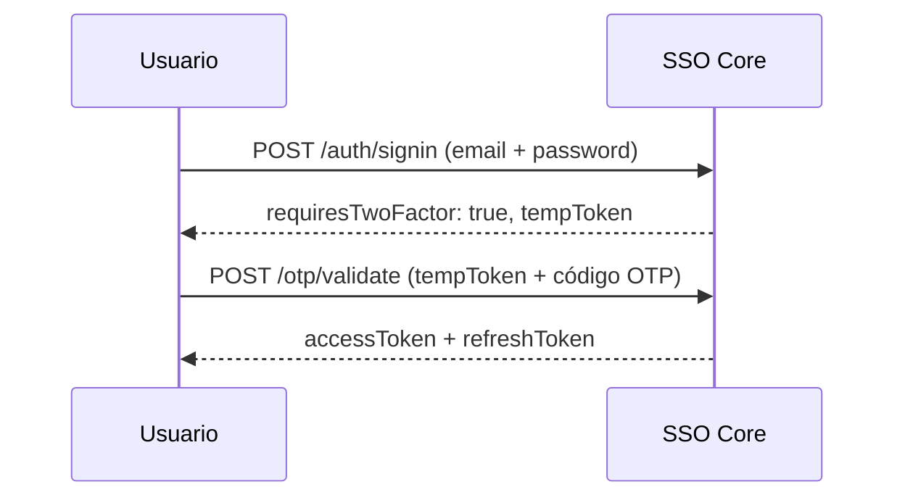

# Seguridad

El SSO Core implementa múltiples capas de seguridad para proteger la autenticación, los datos y las sesiones de los usuarios.

## Contraseñas

### Hashing con Argon2

Las contraseñas se almacenan hasheadas con **Argon2**, el algoritmo ganador de la Password Hashing Competition (PHC). Argon2 es resistente a ataques con GPUs y ASICs por su uso intensivo de memoria.

```
Contraseña → Argon2id → Hash almacenado en BD
```

> [!NOTE]
> Las contraseñas nunca se almacenan en texto plano ni se transmiten en logs. El hash es irreversible.

## JWT (JSON Web Tokens)

### Firma Asimétrica RS256

El SSO Core firma los tokens con **RS256** (RSA + SHA-256):

- **Clave privada**: Solo la tiene el SSO Core para firmar tokens
- **Clave pública**: Disponible para que cualquier servicio verifique tokens

### JWKS Endpoint

La clave pública se distribuye automáticamente vía:

```
GET /.well-known/jwks.json
```

Esto permite a las aplicaciones verificar tokens sin conexión directa al SSO Core.

### Dual Token System

| Token | Duración | Propósito |
| :--- | :--- | :--- |
| Access Token | 1h (configurable) | Acceso a recursos protegidos |
| Refresh Token | 7d (configurable) | Renovar access tokens |

Los refresh tokens implementan **rotación**: cada vez que se usa uno, se invalida y se emite uno nuevo. Esto limita la ventana de ataque si un token es comprometido.

## Cookies SSO

La cookie `sso_session` se configura con las siguientes opciones de seguridad:

```typescript
{
  httpOnly: true,                              // No accesible desde JS
  secure: process.env.NODE_ENV === 'production', // Solo HTTPS en prod
  sameSite: 'lax',                             // Protección CSRF
  maxAge: 24 * 60 * 60 * 1000,                // 24 horas
  domain: process.env.COOKIE_DOMAIN            // Solo en producción
}
```

| Propiedad | Valor | Efecto |
| :--- | :--- | :--- |
| `httpOnly` | `true` | JavaScript no puede leer la cookie (previene XSS) |
| `secure` | `true` (prod) | Solo se envía sobre HTTPS |
| `sameSite` | `lax` | Se envía en navegación top-level, no en iframes/AJAX cross-origin |
| `domain` | `.empire.com` | Compartida entre subdominios (solo en producción) |

> [!WARNING]
> En desarrollo, NO se establece `domain` ni `secure` para compatibilidad con `localhost`.

## Authorization Code Flow

El flujo de autorización implementa medidas de seguridad estrictas:

### Códigos de un solo uso

Los authorization codes:
- Expiran en **5 minutos**
- Son **de un solo uso**: una vez validados, se marcan como usados
- Reutilizar un código genera error `INVALID_AUTH_CODE`
- Se limpian automáticamente vía cron job

### Validaciones en `/auth/authorize`

Antes de generar un código, el sistema verifica:

1. **Sesión SSO válida** — El usuario debe estar autenticado
2. **Membresía en tenant** — El usuario debe ser miembro del tenant solicitado
3. **Aplicación activa** — La app debe existir y estar activa
4. **App habilitada en tenant** — La app debe estar habilitada para ese tenant
5. **Acceso del usuario** — El usuario debe tener acceso a la app en ese tenant

## Row-Level Security (RLS)

El aislamiento de datos entre tenants se implementa a nivel de base de datos con políticas RLS de PostgreSQL:

```sql
-- 1. El middleware establece el tenant activo
SET app.current_tenant_id = 'uuid-del-tenant';

-- 2. La política filtra automáticamente
CREATE POLICY tenant_isolation ON users
USING (tenant_id = current_setting('app.current_tenant_id')::uuid);
```

> [!IMPORTANT]
> Las políticas RLS son la **última línea de defensa**. Incluso si hay un bug en la capa de aplicación, PostgreSQL no permitirá acceder a datos de otro tenant.

## Rate Limiting

Cada endpoint sensible tiene limitadores independientes para prevenir abuso:

| Endpoint | Ventana | Máximo | Propósito |
| :--- | :--- | :--- | :--- |
| `/auth/signup` | 1 hora | 5 | Prevenir creación masiva de cuentas |
| `/auth/signin` | 15 min | 10 | Prevenir brute force |
| `/auth/refresh` | 1 min | 30 | Prevenir abuso de renovación |
| `/auth/signout` | 1 min | 60 | Protección general |

Los limitadores usan headers estándar (`RateLimit-*`) y retornan HTTP 429 cuando se excede el límite.

## CORS

El backend configura CORS para permitir cookies cross-origin:

```typescript
{
  origin: CORS_ORIGIN,       // Orígenes explícitos (no wildcard)
  credentials: true,         // Permite enviar cookies
  methods: ['GET', 'POST', 'PUT', 'DELETE']
}
```

> [!NOTE]
> Para que las cookies funcionen cross-origin, `origin` NO puede ser `*`. Debe ser un origen explícito como `http://localhost:4200`.

## Autenticación de Dos Factores (2FA)

### TOTP (Time-based One-Time Password)

El sistema soporta 2FA basado en TOTP:

1. **Setup**: Se genera un secreto y QR code → El usuario lo escanea con su app (Google Authenticator, Authy)
2. **Verificación**: El usuario ingresa el código de 6 dígitos para activar 2FA
3. **Login**: Si 2FA está activo, el signin retorna un `tempToken` en vez de la sesión. El usuario debe validar con `/otp/validate`
4. **Backup codes**: Se generan códigos de respaldo de 8 caracteres para acceso de emergencia

### Flujo de Login con 2FA



## Roles del Sistema

El SSO Core distingue entre roles de sistema y roles de tenant:

### Roles de Sistema

| Rol | Descripción |
| :--- | :--- |
| `super_admin` | Acceso total al sistema. Puede eliminar aplicaciones |
| `system_admin` | Gestión de aplicaciones y tenants |
| `user` | Usuario regular |

### Roles de Tenant

| Rol | Descripción | Modificable |
| :--- | :--- | :--- |
| `admin` | Acceso total al tenant | No |
| `member` | Lectura/escritura estándar | No |
| `viewer` | Solo lectura | No |
| Roles personalizados | Definidos por el admin del tenant | Sí |

> [!IMPORTANT]
> Los permisos de los roles predeterminados (`admin`, `member`, `viewer`) no se pueden modificar. Solo los roles personalizados admiten cambios.
