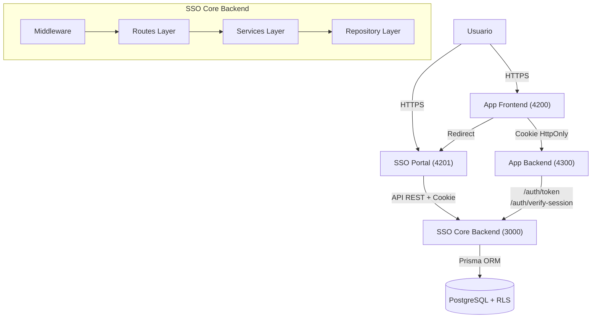
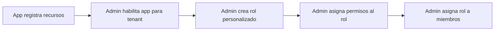
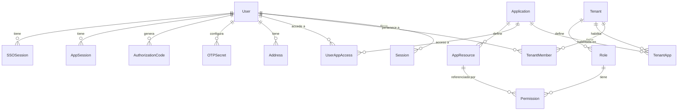

# SSO Core — Arquitectura

## Diagrama General



---

## Componentes Principales

### Capas de la Aplicación

#### Routes (`src/routes/`)

Definen los endpoints HTTP, validan entrada con Joi y delegan al service layer:

| Archivo | Prefijo | Endpoints |
| :--- | :--- | :--- |
| `auth.ts` | `/auth` | signup, signin, logout, authorize, token, verify-session |
| `user.ts` | `/user` | profile, tenants |
| `tenant.ts` | `/tenant` | CRUD, members, apps |
| `role.ts` | `/role` | CRUD, permissions |
| `applications.ts` | `/applications` | CRUD, tenant apps, user access |
| `appResource.ts` | `/app-resources` | register, list, tenant-available |
| `otp.ts` | `/otp` | generate, verify, validate, backup-code |
| `emailVerification.ts` | `/email-verification` | send, verify |
| `session.ts` | `/session` | verify, refresh, revoke |

#### Services (`src/services/`)

Lógica de negocio: autenticación, gestión de sesiones, JWT, OTP, email.

#### Repositories (`src/repositories/`)

Acceso a datos a través de Prisma Client. Un repositorio por modelo de base de datos.

#### Middleware (`src/middleware/`)

| Middleware | Descripción |
| :--- | :--- |
| `auth.ts` | Verifica Bearer token (legacy) |
| `ssoAuth.ts` | Verifica cookie `sso_session` |
| `ssoSystemAdmin.ts` | Verifica roles System Admin / Super Admin |
| `errorHandler.ts` | Manejo centralizado de errores |

---

### Multi-Tenancy

Arquitectura multi-tenant completa con datos lógicamente aislados, roles independientes y aplicaciones habilitadas por separado.

```
Tenant
├── Members (usuarios)
│   └── Role (admin, member, viewer, personalizado)
│       └── Permissions (resource + action + applicationId)
├── Roles personalizados
└── Apps habilitadas (TenantApp)
    └── User App Access (qué miembros usan qué apps)
```

#### RBAC — Control de Acceso Basado en Roles

Cada permiso está vinculado a una **aplicación específica** y define un par `resource:action`. Las aplicaciones registran sus recursos mediante `/app-resources`.



#### Roles de Sistema

| Rol | Descripción |
| :--- | :--- |
| `super_admin` | Acceso total al sistema. Puede eliminar aplicaciones |
| `system_admin` | Gestión de aplicaciones y tenants |
| `user` | Usuario regular |

#### Roles de Tenant (Predeterminados)

| Rol | Descripción | Modificable |
| :--- | :--- | :--- |
| `admin` | Acceso total al tenant (18 permisos SSO) | No |
| `member` | Lectura/escritura estándar (4 permisos) | No |
| `viewer` | Solo lectura (1 permiso) | No |
| Personalizados | Definidos por el admin del tenant | Sí |

---

### Modelo de Datos



#### Tablas Principales

| Tabla | Propósito |
| :--- | :--- |
| `User` | Usuarios del sistema (email, passwordHash, systemRole) |
| `Tenant` | Organizaciones (name, slug) |
| `TenantMember` | Relación usuario-tenant con rol |
| `Application` | Apps registradas (appId, name, url) |
| `TenantApp` | Apps habilitadas por tenant |
| `UserAppAccess` | Control granular de acceso usuario → app → tenant |
| `Role` / `Permission` | Roles personalizables con permisos por app |
| `AppResource` | Catálogo de recursos disponibles por aplicación |
| `Session` / `SSOSession` / `AppSession` | Sesiones legacy, SSO y por aplicación |
| `AuthorizationCode` | Códigos de un solo uso para el flujo SSO |

---

## Decisiones Técnicas Relevantes

### ¿Por qué Authorization Code Flow?

- Los tokens **nunca** se exponen en el frontend
- El código de autorización es de **un solo uso** con TTL de 5 minutos
- Los backends validan directamente con el SSO Core

### ¿Por qué Cookies HttpOnly?

- Inmunes a ataques XSS (JavaScript no puede leerlas)
- Se envían automáticamente en cada request
- `SameSite: lax` previene ataques CSRF
- `Secure: true` en producción fuerza HTTPS

### ¿Por qué RS256 y no HS256?

- La clave privada solo la tiene el SSO Core
- Las aplicaciones verifican con la clave pública
- No necesitan conectarse al SSO Core para cada request
- Endpoint JWKS (`/.well-known/jwks.json`) distribuye claves

### ¿Por qué RLS en PostgreSQL?

- Aislamiento entre tenants a **nivel de base de datos**
- Incluso con un bug en la aplicación, los datos de otro tenant no son accesibles
- Las políticas SQL se aplican transparentemente a todas las queries

```sql
-- El middleware establece el tenant activo
SET app.current_tenant_id = 'uuid-del-tenant';

-- La política filtra automáticamente
CREATE POLICY tenant_isolation ON users
USING (tenant_id = current_setting('app.current_tenant_id')::uuid);
```

### Seguridad de Contraseñas

Las contraseñas se almacenan con **Argon2** (ganador de la Password Hashing Competition), resistente a ataques con GPUs y ASICs.

### Dual Token System

| Token | Duración | Propósito |
| :--- | :--- | :--- |
| Access Token | 1h (configurable) | Acceso a recursos protegidos |
| Refresh Token | 7d (configurable) | Renovar access tokens |

Los refresh tokens implementan **rotación**: cada uso invalida el token anterior y emite uno nuevo.

---

## Dependencias Externas

| Tecnología | Versión | Propósito |
| :--- | :--- | :--- |
| Node.js | 18+ | Runtime server-side |
| Express | 4.18 | Framework HTTP |
| Prisma | — | ORM / Migrations |
| PostgreSQL | 14+ | Persistencia con RLS |
| Argon2 | — | Hashing de contraseñas |
| jsonwebtoken | — | Firma asimétrica JWT (RS256) |
| Joi | — | Validación de schemas |
| express-rate-limit | — | Rate limiting por endpoint |
| Nodemailer / Resend | — | Email (verificación y notificaciones) |
