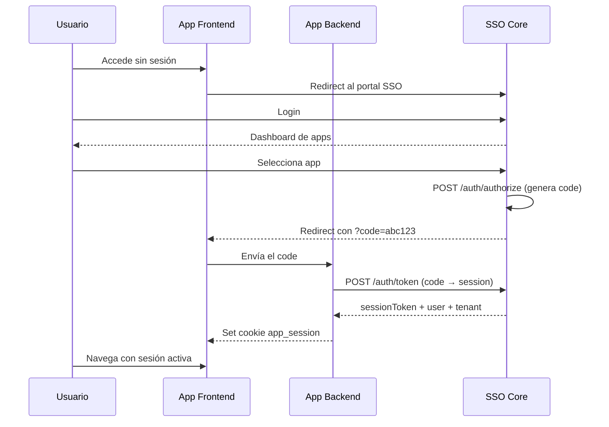

# SSO Core — Integración

## APIs Expuestas

Todos los endpoints usan el prefijo `/api/v1`. Los endpoints protegidos requieren una cookie `sso_session` válida o un header `Authorization: Bearer <token>`.

### Autenticación (`/auth`)

| Método | Endpoint | Descripción | Autenticación |
| :--- | :--- | :--- | :--- |
| POST | `/auth/signup` | Registrar usuario | Público (rate limit: 5/h) |
| POST | `/auth/signin` | Iniciar sesión (establece cookie) | Público (rate limit: 10/15min) |
| POST | `/auth/signout` | Cerrar sesión (refresh token legacy) | Bearer token |
| POST | `/auth/logout` | Cerrar sesión SSO (cookie) | Cookie `sso_session` |
| POST | `/auth/refresh` | Renovar tokens | Público (rate limit: 30/min) |
| POST | `/auth/authorize` | Generar authorization code | Cookie `sso_session` |
| POST | `/auth/validate-code` | Validar code y obtener contexto | Público (backend-to-backend) |
| POST | `/auth/token` | Intercambiar code por session token | Público (backend-to-backend) |
| POST | `/auth/verify-session` | Verificar session token de app | Público (backend-to-backend) |

### Usuarios (`/user`)

| Método | Endpoint | Descripción | Autenticación |
| :--- | :--- | :--- | :--- |
| GET | `/user/profile` | Obtener perfil del usuario autenticado | Cookie `sso_session` |
| PUT | `/user/profile` | Actualizar perfil (datos + direcciones) | Cookie `sso_session` |
| GET | `/user/tenants` | Tenants del usuario con apps habilitadas | Cookie `sso_session` |
| GET/PUT/DELETE | `/user/:userId` | CRUD por ID | Bearer token |

### Tenants (`/tenant`)

| Método | Endpoint | Descripción | Autenticación |
| :--- | :--- | :--- | :--- |
| POST | `/tenant` | Crear tenant | Cookie + System Admin |
| GET | `/tenant` | Listar tenants | Cookie `sso_session` |
| POST | `/tenant/:id/members` | Invitar miembro | Cookie + Tenant Admin |
| GET | `/tenant/:id/members` | Listar miembros | Cookie + Tenant Member |
| PUT | `/tenant/:id/members/:mId` | Cambiar rol | Cookie + Tenant Admin |
| DELETE | `/tenant/:id/members/:mId` | Eliminar miembro | Cookie + Tenant Admin |
| GET | `/tenant/:id/apps` | Apps del tenant | Cookie + Tenant Member |

### Roles (`/role`)

| Método | Endpoint | Descripción | Autenticación |
| :--- | :--- | :--- | :--- |
| POST | `/role` | Crear rol personalizado | Cookie `sso_session` |
| GET | `/role/tenant/:tenantId` | Listar roles del tenant | Cookie + Tenant Member |
| GET/PUT/DELETE | `/role/:roleId` | CRUD de rol | Cookie `sso_session` |
| POST | `/role/:roleId/permission` | Agregar permiso | Cookie `sso_session` |
| GET | `/role/:roleId/permission` | Listar permisos | Cookie `sso_session` |
| DELETE | `/role/:roleId/permission/:pId` | Eliminar permiso | Cookie `sso_session` |

### Aplicaciones (`/applications`)

| Método | Endpoint | Descripción | Autenticación |
| :--- | :--- | :--- | :--- |
| POST | `/applications` | Crear aplicación | Cookie + System Admin |
| GET | `/applications` | Listar todas (`?active=true`) | Cookie + System Admin |
| POST | `/applications/tenant/:tId/enable` | Habilitar app para tenant | Cookie + System Admin |
| POST | `/applications/tenant/:tId/:appId/grant` | Dar acceso a usuario | Cookie + Tenant Admin |
| POST | `/applications/tenant/:tId/:appId/grant-bulk` | Acceso masivo | Cookie + Tenant Admin |
| GET | `/applications/user/:tenantId` | Apps del usuario autenticado | Cookie `sso_session` |

### App Resources (`/app-resources`)

| Método | Endpoint | Descripción | Autenticación |
| :--- | :--- | :--- | :--- |
| POST | `/app-resources` | Registrar recursos de app | Cookie `sso_session` |
| GET | `/app-resources/:appId` | Obtener recursos de app | Cookie `sso_session` |
| GET | `/app-resources/tenant/:tId/available` | Recursos disponibles en tenant | Cookie `sso_session` |

### OTP — 2FA (`/otp`)

| Método | Endpoint | Descripción |
| :--- | :--- | :--- |
| POST | `/otp/generate` | Generar secreto y QR code |
| POST | `/otp/verify` | Verificar token y activar 2FA |
| POST | `/otp/validate` | Validar OTP durante login (con tempToken) |
| POST | `/otp/backup-code` | Usar código de respaldo |
| POST | `/otp/disable` | Desactivar 2FA |
| GET | `/otp/status/:userId` | Verificar si 2FA está activo |

---

## Ejemplos de Consumo

### Flujo Completo SSO (Authorization Code)



### Paso a Paso con cURL

**1. Login en SSO:**

```bash
curl -X POST http://localhost:3000/api/v1/auth/signin \
  -H "Content-Type: application/json" \
  -c cookies.txt \
  -d '{"nuid":"admin@example.com","password":"admin123"}'
```

**2. Generar authorization code:**

```bash
curl -X POST http://localhost:3000/api/v1/auth/authorize \
  -H "Content-Type: application/json" \
  -b cookies.txt \
  -d '{
    "tenantId": "uuid-tenant",
    "appId": "crm",
    "redirectUri": "http://localhost:4200/callback"
  }'
```

**3. Intercambiar code por session:**

```bash
curl -X POST http://localhost:3000/api/v1/auth/token \
  -H "Content-Type: application/json" \
  -d '{"authCode":"abc123","appId":"crm"}'
```

**4. Verificar sesión:**

```bash
curl -X POST http://localhost:3000/api/v1/auth/verify-session \
  -H "Content-Type: application/json" \
  -d '{"sessionToken":"jwt-from-step-3","appId":"crm"}'
```

---

## Contratos

### Registro de Usuario

**Request:**

```json
{
  "email": "user@example.com",
  "password": "SecurePass123!",
  "firstName": "Juan",
  "lastName": "Pérez"
}
```

**Response (201):**

```json
{
  "success": true,
  "message": "User created successfully",
  "user": {
    "userId": "uuid",
    "email": "user@example.com"
  }
}
```

### Authorization Code

**Request (`/auth/authorize`):**

```json
{
  "tenantId": "uuid-del-tenant",
  "appId": "crm",
  "redirectUri": "https://crm.empire.com/callback"
}
```

**Response:**

```json
{
  "success": true,
  "authCode": "code-one-time-use",
  "redirectUri": "https://crm.empire.com/callback?code=code-one-time-use"
}
```

### Token Exchange

**Request (`/auth/token`):**

```json
{
  "authCode": "code-from-authorize",
  "appId": "crm"
}
```

**Response:**

```json
{
  "success": true,
  "sessionToken": "jwt-session-token",
  "expiresAt": "2026-02-13T19:00:00.000Z",
  "user": {
    "userId": "uuid",
    "email": "user@example.com",
    "firstName": "Juan",
    "lastName": "Pérez"
  },
  "tenant": {
    "tenantId": "uuid",
    "name": "Mi Empresa",
    "slug": "mi-empresa",
    "role": "admin"
  }
}
```

### Formato de Errores

```json
{
  "error": "ERROR_CODE",
  "message": "Descripción legible del error",
  "details": [],
  "timestamp": "2026-02-12T19:00:00.000Z"
}
```

| Código HTTP | Error Code | Descripción |
| :--- | :--- | :--- |
| 400 | `VALIDATION_ERROR` | Datos de entrada inválidos |
| 401 | `UNAUTHORIZED` | No autenticado |
| 403 | `FORBIDDEN` | Sin permisos suficientes |
| 403 | `TENANT_ACCESS_DENIED` | Sin acceso al tenant |
| 403 | `APP_ACCESS_DENIED` | Sin acceso a la aplicación |
| 404 | `NOT_FOUND` | Recurso no encontrado |
| 409 | `APP_ID_EXISTS` | ID de app ya existe |
| 429 | — | Rate limit excedido |

---

## Autenticación

### Cookie SSO (`sso_session`)

La autenticación principal usa cookies HttpOnly:

```typescript
{
  httpOnly: true,
  secure: process.env.NODE_ENV === 'production',
  sameSite: 'lax',
  maxAge: 24 * 60 * 60 * 1000,
  domain: process.env.COOKIE_DOMAIN  // solo en producción
}
```

### JWKS Endpoint

La clave pública se distribuye vía:

```
GET /.well-known/jwks.json
```

Las aplicaciones pueden verificar tokens sin conexión directa al SSO Core.

---

## Casos de Uso: Integrar una Aplicación

### 1. Registrar la aplicación

```bash
curl -X POST http://localhost:3000/api/v1/applications \
  -H "Content-Type: application/json" \
  -b cookies.txt \
  -d '{
    "appId": "crm",
    "name": "CRM System",
    "url": "https://crm.empire.com",
    "description": "Sistema de gestión de clientes"
  }'
```

### 2. Habilitar para tenant

```bash
curl -X POST http://localhost:3000/api/v1/applications/tenant/{tenantId}/enable \
  -H "Content-Type: application/json" \
  -b cookies.txt \
  -d '{"applicationId": "uuid-de-la-aplicacion"}'
```

### 3. Otorgar acceso a usuarios

```bash
curl -X POST http://localhost:3000/api/v1/applications/tenant/{tenantId}/{appId}/grant \
  -H "Content-Type: application/json" \
  -b cookies.txt \
  -d '{"userId": "uuid-del-usuario"}'
```

### 4. Implementar callback en tu backend

```typescript
// routes/auth.ts (en tu aplicación)
router.post('/callback', async (req, res) => {
  const { code } = req.body;

  const response = await axios.post(`${SSO_URL}/api/v1/auth/token`, {
    authCode: code,
    appId: 'crm'
  });

  const { sessionToken, expiresAt, user, tenant } = response.data;

  res.cookie('app_session', sessionToken, {
    httpOnly: true,
    secure: process.env.NODE_ENV === 'production',
    sameSite: 'lax',
    maxAge: 24 * 60 * 60 * 1000
  });

  res.json({ success: true, user, tenant });
});
```

### 5. Middleware de verificación de sesión

```typescript
// middleware/ssoAuth.ts (en tu aplicación)
export async function ssoAuthMiddleware(req, res, next) {
  const sessionToken = req.cookies['app_session'];

  if (!sessionToken) {
    return res.status(401).json({ error: 'No session' });
  }

  const response = await axios.post(`${SSO_URL}/api/v1/auth/verify-session`, {
    sessionToken,
    appId: 'crm'
  });

  if (!response.data.valid) {
    return res.status(401).json({ error: 'Invalid session' });
  }

  req.ssoUser = response.data.user;
  req.ssoTenant = response.data.tenant;
  next();
}
```

> **Tip:** Para mejorar el rendimiento, cachea el resultado de `/verify-session` localmente (ej. Redis con TTL de 60s).

### 6. Registrar recursos para RBAC

```bash
curl -X POST http://localhost:3000/api/v1/app-resources \
  -H "Content-Type: application/json" \
  -b cookies.txt \
  -d '{
    "appId": "crm",
    "resources": [
      { "resource": "contacts", "action": "create", "category": "sales" },
      { "resource": "contacts", "action": "read", "category": "sales" },
      { "resource": "invoices", "action": "create", "category": "billing" },
      { "resource": "reports", "action": "read", "category": "analytics" }
    ]
  }'
```

### Troubleshooting

| Error | Causa | Solución |
| :--- | :--- | :--- |
| `APP_ACCESS_DENIED` | Usuario sin acceso a la app en el tenant | Verificar `TenantApp` y `UserAppAccess` |
| `APP_NOT_ENABLED_FOR_TENANT` | App no habilitada para el tenant | Usar `/applications/tenant/:id/enable` |
| `INVALID_AUTH_CODE` | Code ya usado o expirado | Generar nuevo code (un solo uso, 5 min TTL) |
